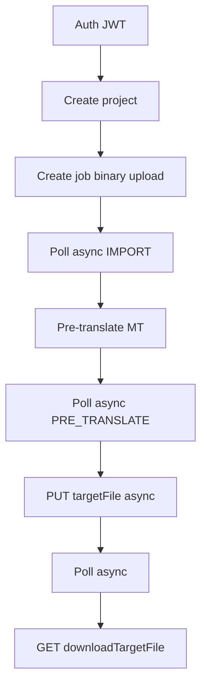

# Phrase API reference notes (operators only)

Internal notes from Phrase Help Center + Developer Hub.  
**Do not surface vendor names in the Locaitra Translate UI.**

Sources:
- https://support.phrase.com/hc/en-us
- https://developers.phrase.com/en/home
- https://developers.phrase.com/en/api/platform/authentication
- https://support.phrase.com/hc/en-us/articles/5709682579996-Using-APIs-TMS
- https://support.phrase.com/hc/en-us/articles/5709717749788-Pre-translation-TMS
- https://developers.phrase.com/en/api/tms/latest/introduction
- https://developers.phrase.com/en/api/language-ai/introduction

---

## Product map

| Product | Role |
|---------|------|
| **Phrase Platform** | Unified login / access tokens → JWT for all apps |
| **Phrase TMS** | Projects, jobs, import/conversion, pre-translate, target download |
| **Phrase Language AI** | Standalone MT API (engine selection); also powers TMS MT engines |
| **Phrase Strings** | Key-based product copy (not used by Locaitra Translate v1) |
| **Orchestrator / Studio / Connectors** | Workflows, media, integrations (out of scope for v1) |

## Auth (what we use)

Platform access token (Profile → Access tokens, scoped for TMS):

1. `POST https://eu.phrase.com/idm/oauth/token`  
   `grant_type=urn:ietf:params:oauth:grant-type:token-exchange`  
   `subject_token=<PLATFORM_TOKEN>`
2. Use `Authorization: Bearer <JWT>` on TMS calls  
3. JWT expires ~4 hours — refresh before expiry  

US region: `https://us.phrase.com/idm/oauth/token` + `https://us.cloud.memsource.com/web`

Legacy alternative: `POST /api2/v3/auth/login` with username/password → `Authorization: ApiToken <token>` (24h).

Always send `User-Agent` identifying the app (TMS docs requirement).

## Canonical TMS file pipeline (official “Using APIs”)

1. **Create project** — `name`, `sourceLang`, `targetLangs`  
2. **Create job** — binary body + headers:  
   - `Content-Disposition: filename*=UTF-8''name.ext`  
   - `Memsource: {"targetLangs":["de"]}`  
   - `Content-Type: application/octet-stream`  
3. **Poll** `GET /api2/v1/async/{asyncRequestId}` until import done  
4. **Pre-translate** — MT engine must be attached to the project (`mtSettingsPerLanguage` with engine **numeric id**)  
5. **Download target** (docs):  
   - `PUT /api2/v2/projects/{projectUid}/jobs/{jobUid}/targetFile` → async id  
   - poll async  
   - `GET .../downloadTargetFile/{asyncRequestId}` (one-time use)  
6. Optionally `setStatus` project/job to `COMPLETED`

## Pre-translation (support article)

- Applies TM / non-translatables / **machine translation** into targets  
- MT must be **assigned to the project** or pre-translate inserts nothing  
- Options: confirm segments, set job completed after pre-translate, QPS thresholds  
- Our app: Language AI engine via `machineTranslateSettings: { id }`, insert into target, then export  

## Language AI API (optional alternative)

Standalone MT without TMS projects — good for text snippets.  
Locaitra Translate v1 stays on **TMS** so file conversion (Office → segments → reconstructed file) is handled by job import.

## How Locaitra Translate maps to this

| Official step | Our code |
|---------------|----------|
| Platform token → JWT | `server/src/tms/client.js` `_ensureAuthHeader` |
| Create project + MT settings | `createProject` + `setProjectMtSettings` |
| Create job + async wait | `createJob` + `waitAsync` |
| Pre-translate | `preTranslate` |
| Download target | `downloadTarget` (PUT v2 + fallback GET) |
| User-facing UI | upload → translate → download only |

EU base URL we use: `https://cloud.memsource.com/web`
